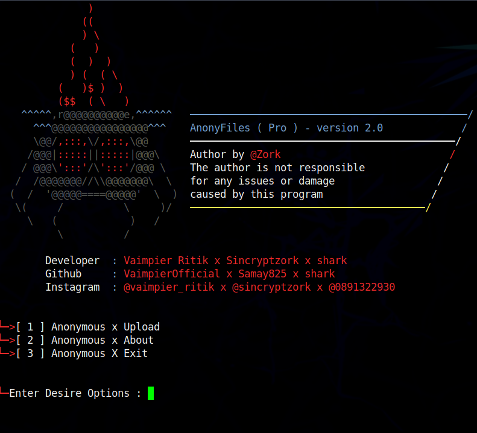

# Anonyfiles -Upload Anonymous
 

- What is AnonyFiles anonymous System  ?
> This is Uploader which requires nothing.
> You can upload maximum 20gb of file.
> If you find yourself in that situation then you can upload anything and save the link!
> You can Upload Unlimitedly files ,zip anything only .txt you can't upload.
> this tool made by @samay825 

 

- AnonyFiles Version features 

* `Upload Unlimitedly files anonymous.`

* `Supports newest Android also.`

* `Instant Upload with speed.`

* `Working with all Operators/Carriers.`

* `No missing API issues, all files will be uploaded.`

*  For Contact Instagram : sincryptzork or vaimpier_ritik 

 

- Support

> `termux and all linux os windows.etc..`

> `All over world.`

> `Update will be soon.`
 
  

- Installation & Step's
 
> `apt update && apt upgrade`
 
> `git clone https://github.com/samay825/Anonyfiles.git`
 
> `cd Anonyfiles`  
 
> `python3 main.py`

 

<h3>Visitors :</h3>
 

